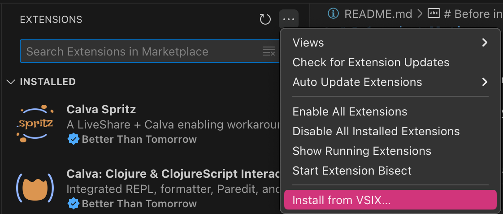

# Info

This extension is developed for painless transition from Doom Emacs to VSCode for clojure developers.
Extension in dev state so the installation for now may be confusing. In future iterations of this project smooth config automerge and dependency regulation will be added.

# Before installation

## Macos hints

* For normal use hjkl navigation:
  ```defaults write com.microsoft.VSCode ApplePressAndHoldEnabled -bool false```
* For fixing delay between space keypreses:
 [Disable](https://vspacecode.github.io/docs/troubleshooting/) ```Add period with double-space``` macos option

## Temporary deps

* For JSON<->YAML<->EDN conversions install [borkdude/jet](https://github.com/borkdude/jet)

# Installation

## Step one 
 
To install extension in your VSCode you should clone this repo and build it with ```vsce package``` npm module. Vsce is dependency of a project so you may just run ```npm install``` before build.

## Step two
When ```vsdoom.vsix``` file is created in your repo folder you may add it as vsix localy.


## Step three
We highly recomend to copy [settings.json](recomended-profile-setup/settings.json) and [keybinding.json](recomended-profile-setup/keybindings.json) to your ```default``` profile for more smooth experience. Note that some bindings work with default VSCode profile ONLY.

# After installation

* If M-x behavior is not working properly try to call command palette action [Enable VSpaceCode configuration and keybindings](https://vspacecode.github.io/docs/troubleshooting/#unresponsive-menu-activation)